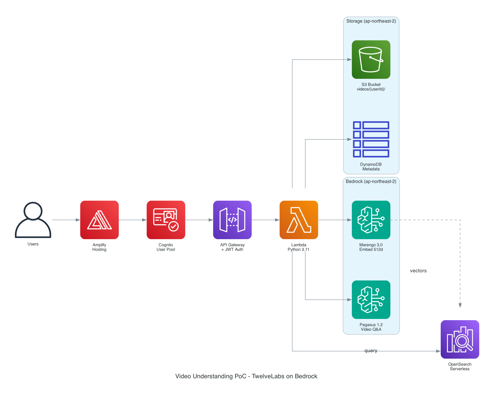

# Video Understanding PoC with Twelve Labs Models

Cognito 인증 기반의 영상 AI PoC 애플리케이션. Amazon Bedrock의 Twelve Labs 모델(Marengo 3.0 / Pegasus 1.2)을 사용하여 영상 분석, 임베딩 생성, 시맨틱 검색을 제공합니다.

> **원본 레포**: [ltrain81/TwelveLabs-on-bedrock-demo](https://github.com/ltrain81/TwelveLabs-on-bedrock-demo)  
> **변경사항**: Cognito 인증 추가, Amplify 호스팅, Marengo 3.0 업그레이드, 서울 리전 배포, 사용자별 S3 격리

## Architecture



```
Users → Amplify Hosting → Cognito User Pool → API Gateway (JWT Auth)
                                                     ↓
                                                  Lambda (Python 3.11)
                                                  ↓        ↓        ↓
                                               S3 Bucket  Bedrock  OpenSearch
                                          videos/{userId}/ Models   Serverless
                                                  ↓
                                              CloudFront
```

**리전**: ap-northeast-2 (서울) — 모든 리소스가 서울에 배포됩니다.

## 사용자 흐름

```
1. 회원가입/로그인 (Cognito)
2. 영상 업로드 → S3에 사용자별 격리 저장 (videos/{userId}/)

3. [1회성] Analyze (Pegasus 1.2)
   → "이 영상을 설명해줘" → 텍스트 응답

4. [1회성] Embed (Marengo 3.0)
   → 영상을 10초 단위로 쪼개서 512차원 벡터로 변환
   → OpenSearch Serverless에 저장

5. [반복] Search (Marengo 3.0 + OpenSearch)
   → 자연어 검색어 → 벡터 변환 → 유사 벡터 검색
   → 매칭된 영상 구간(타임스탬프) 반환
```

## Features

### 🔐 인증
- Cognito User Pool 기반 회원가입/로그인
- 이메일 인증, JWT 토큰 기반 API 인가
- 사용자별 S3 경로 격리

### 🎥 영상 업로드
- S3 Presigned POST로 직접 업로드
- MP4, MOV, AVI 지원 (최대 2GB)
- 드래그앤드롭 인터페이스

### 🧠 영상 분석 (Pegasus 1.2)
- 영상 업로드 후 1회성 분석
- 커스텀 프롬프트 기반 질의응답
- 장면, 행동, 객체 인식 및 텍스트 생성

### 🔍 영상 임베딩 (Marengo 3.0)
- 10초 단위 세그먼트별 512차원 벡터 생성
- Visual + Audio 임베딩
- OpenSearch Serverless에 자동 인덱싱

### 🔎 시맨틱 검색
- 자연어 검색어로 영상 구간 검색
- 벡터 유사도 기반 랭킹
- 타임스탬프 단위 결과 반환

## Tech Stack

| 레이어 | 기술 |
|--------|------|
| Frontend | React 18 + TypeScript + Amplify UI |
| Hosting | AWS Amplify |
| Auth | Amazon Cognito |
| API | API Gateway + Cognito Authorizer |
| Backend | Python 3.11 + AWS Lambda |
| Storage | Amazon S3 + CloudFront |
| Vector DB | OpenSearch Serverless (kNN) |
| AI Models | Twelve Labs Marengo 3.0 + Pegasus 1.2 (Bedrock) |
| IaC | AWS CDK (TypeScript) |
| Region | ap-northeast-2 (서울) |

## Model Information

| | Marengo 3.0 (임베딩) | Pegasus 1.2 (생성형 VLM) |
|---|---|---|
| Model ID | `twelvelabs.marengo-embed-3-0-v1:0` | `twelvelabs.pegasus-1-2-v1:0` |
| 역할 | 영상 → 벡터 변환 | 영상 → 텍스트 생성 |
| 임베딩 차원 | 512 | - |
| 최대 영상 | 4시간 / 6GB | 1시간 / 2GB |
| API | `StartAsyncInvoke` (비동기) | `InvokeModel` (동기) |
| 용도 | 검색, 유사도 비교, 분류 | 영상 설명, 질의응답 |

## Prerequisites

- AWS CLI configured
- Node.js 18+ / npm
- Python 3.11+
- AWS CDK CLI (`npm install -g aws-cdk`)
- Bedrock 콘솔에서 TwelveLabs 모델 opt-in (서울 리전)

## Quick Start

```bash
git clone <repository>
cd TwelveLabs-on-bedrock-demo
chmod +x deploy.sh
./deploy.sh
```

`deploy.sh`가 자동으로:
1. CDK 인프라 배포 (Cognito, API GW, Lambda, S3, OpenSearch, CloudFront, Amplify)
2. CloudFormation Output 읽기
3. Frontend 빌드 (환경변수 주입)
4. Amplify에 배포

배포 완료 후 출력되는 `https://main.{APP_ID}.amplifyapp.com` 으로 접속합니다.

## Environment Variables

### CDK Outputs (자동 설정)

| Output | 설명 |
|--------|------|
| `ApiUrl` | API Gateway URL |
| `VideoBucketName` | S3 버킷명 |
| `OpenSearchEndpoint` | OpenSearch 엔드포인트 |
| `UserPoolId` | Cognito User Pool ID |
| `UserPoolClientId` | Cognito Client ID |
| `AmplifyAppId` | Amplify App ID |
| `CloudFrontDomain` | CloudFront 도메인 |

### Frontend 환경변수 (빌드 시 주입)

| Variable | 설명 |
|----------|------|
| `REACT_APP_API_URL` | API Gateway URL |
| `REACT_APP_USER_POOL_ID` | Cognito User Pool ID |
| `REACT_APP_USER_POOL_CLIENT_ID` | Cognito Client ID |
| `REACT_APP_REGION` | AWS 리전 |

## API Endpoints

모든 엔드포인트는 Cognito JWT 인증 필수.

### POST /upload
영상 업로드용 S3 Presigned URL 발급.
```json
// Request
{ "filename": "video.mp4", "contentType": "video/mp4" }
// Response
{ "uploadUrl": "https://...", "fields": {...}, "key": "videos/{userId}/video.mp4", "bucket": "..." }
```

### POST /analyze
Pegasus로 영상 분석 (비동기 시작 → 상태 폴링).
```json
// Request
{ "s3Uri": "s3://bucket/videos/{userId}/video.mp4", "prompt": "이 영상을 설명해줘", "videoId": "..." }
// Response
{ "analysisJobId": "analysis_...", "status": "processing" }
```

### POST /embed
Marengo 3.0으로 임베딩 생성 (비동기).
```json
// Request
{ "s3Uri": "s3://bucket/videos/{userId}/video.mp4", "videoId": "..." }
// Response
{ "invocationArn": "arn:aws:bedrock:...", "status": "processing" }
```

### GET /status
분석 또는 임베딩 작업 상태 확인.
```
GET /status?analysisJobId=analysis_...
GET /status?invocationArn=arn:aws:bedrock:...
```

### GET /search?q=query
자연어로 영상 구간 검색.
```json
// Response
{ "results": [{ "videoId": "...", "startSec": 10, "endSec": 20, "score": 0.95, ... }], "total": 5, "search_time_ms": 45 }
```

## Cost Considerations

| 항목 | 가격 |
|------|------|
| Marengo 3.0 영상 임베딩 | $0.00070/초 ($0.042/분) |
| Marengo 3.0 텍스트 쿼리 | $0.00007/건 |
| Pegasus 1.2 영상 입력 | $0.00049/초 |
| Pegasus 1.2 텍스트 출력 | $0.0075/1K 토큰 |
| OpenSearch Serverless | OCU 기반 과금 |
| S3 저장 | ~$0.023/GB/월 |

## License

MIT License
